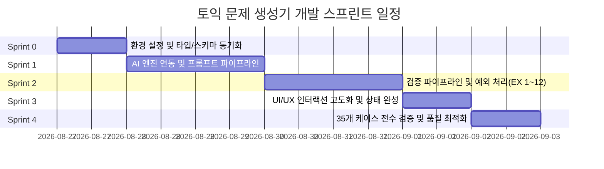

# 취약 단어 타겟형 토익 문제 생성기 (v1.0) 개발 계획서

본 문서는 루트의 [`PRD.md`](file:///c:/test/PRD.md)에 명시된 요구사항, 제약 조건, 예외 처리 규칙(EX-1~EX-12), 완료 조건(D-1~D-12, S1~S8)을 충실히 반영하여 작성된 스프린트 기반의 개발 계획서입니다.

---

## 1. 개요 및 핵심 원칙

### 1.1 프로젝트 개요
- **제품명**: 취약 단어 타겟형 토익 문제 생성기 (v1.0)
- **핵심 가치**: 수험생이 입력한 취약 단어(1~5개)를 반영하여 **단 1회의 AI 호출**로 Part 5 문제 3문항과 4지 선지 전체 해설을 생성하고, 풀이 시 **추가 네트워크 호출 없이 즉각(<200ms)** 해설을 제공하는 단일 화면 웹 애플리케이션.
- **범위**: 단일 화면 · 핵심 기능 1개 · 로그인/결제/DB 없음 · 무저장(In-Memory State Only).

### 1.2 핵심 설계 및 구현 불변 원칙 (Non-Negotiable)
1. **AI 호출 세션당 정확히 1회**: 문제 생성 시 1회만 호출하며, 풀이·해설·결과 화면에서는 네트워크 요청이 절대 발생하지 않아야 함.
2. **전량 클라이언트 메모리 관리**: 생성된 데이터는 메모리에 유지하며, 지연 로딩을 금지함.
3. **영속 저장소 일체 사용 금지**: DB, `localStorage`, `sessionStorage`, `cookie`, `IndexedDB` 사용 금지 (새로고침 시 완전 초기화).
4. **단일 화면(Single Page State Transition)**: 라우팅/페이지 이동 없이 화면 내부 상태(Phase) 전환으로만 작동.
5. **예외 처리 및 자동 재시도 원칙**: 기술 용어 노출 금지, 부분 성공 수용(1~2문항), 사전 검증 기반 문항 폐기, 자동 재시도 세션당 최대 1회.

---

## 2. 현 상태 분석 (As-Is) 및 목표 (To-Be)

| 영역 | 현재 상태 (As-Is) | 목표 상태 (To-Be) |
|---|---|---|
| **데이터 소스** | Mock 데이터 기반 시뮬레이션 (`lib/mock-questions.ts`, `setTimeout`) | 실제 AI API(Gemini / OpenAI 등) 연동 Route Handler 및 프롬프트 파이프라인 구축 |
| **타입 & 스키마** | `Question` 인터페이스 일부 필드 불일치 (`sentence` vs `stem`, `targetNote` vs `wordNote`) | PRD §4.1 F-4 필드 명세와 100% 일치하도록 스키마 동기화 |
| **예외 처리** | DevPanel 기반 수동 상태 시뮬레이션 위주 | `lib/validator.ts` 기반 EX-1 ~ EX-12 실시간/응답 파싱 검증 파이프라인 자동화 |
| **어간 검증** | 미구현 | 영문 어간(Stem) 기반 4~5글자 매칭 및 파생형 유효성 검증 엔진 구현 (EX-5) |
| **공유 기능** | Web Share API 및 클립보드 복사 폴백 구현됨 | PRD §3.3 공유 템플릿 표준 규격 준수 및 수동 복사 UI 폴백 완비 |
| **품질 검증** | 단위/통합 테스트 없음 | 35개 예외 검증 케이스 및 S1~S6 연속 측정 자동화/수동 검증 체계 확립 |

---

## 3. 스프린트 로드맵 (Sprint Roadmap)

---

## 4. 스프린트별 상세 개발 계획

### 🚀 Sprint 0: 기반 정비 및 타입/스키마 동기화
- **목표**: PRD 규격에 맞춘 타입 시스템 재정의, AI 백엔드 Route Handler 골격 생성, 공통 유틸리티 기초 작업.
- **주요 작업 내용**:
  1. **타입 정의 동기화 ([`lib/quiz-types.ts`](file:///c:/test/lib/quiz-types.ts))**:
     - PRD F-4 스키마 준수: `stem`, `choices` (4개 고정), `answer` ('A'|'B'|'C'|'D'), `explanations` (A, B, C, D 4개 선지별 해설), `translation`, `wordNote`, `targetWord`, `type` (`vocab` | `grammar` | `prep_conj`).
  2. **환경 변수 및 AI 클라이언트 설정**:
     - `.env.local` 템플릿 구성 (`AI_API_KEY`, `AI_MODEL` 등).
     - 서버 사이드 API Route (`app/api/generate/route.ts`) 기본 구조 작성 (Edge/Node 런타임 결정).
  3. **어간 추출 및 단어 파싱 유틸리티 개선 ([`lib/parse-words.ts`](file:///c:/test/lib/parse-words.ts))**:
     - 허용 문자 검사 (A-Z, a-z, 하이픈, 어퍼스트로피, 내부 공백).
     - 중복 제거, 공백 트림, 5개 초과 시 절삭 및 고지 로직 정밀화.
- **완료 기준 (DoD)**:
  - TypeScript 컴파일 에러 0건.
  - PRD F-4 스키마와 TypeScript 인터페이스 1:1 일치.

---

### 🚀 Sprint 1: AI 프롬프트 엔지니어링 및 생성 엔진 연동
- **목표**: 1회 호출로 3문항(유형 혼합)을 정확한 JSON 형태로 생성하고 파싱하는 서버/클라이언트 파이프라인 구축.
- **주요 작업 내용**:
  1. **Part 5 전용 시스템 프롬프트 및 지시문 설계**:
     - 입력 단어(1~5개)와 난이도(쉬움/보통/어려움) 반영.
     - **유형 배분 강제**: `vocab` 1개 이상, `grammar`/`prep_conj` 1개 이상, 3문항 전부 동일 유형 금지 (F-3).
     - **선지 구성**: 정답 1개 유일성, 매력적인 오답 3개 구성, 각 선지별 전용 해설 필수 작성.
     - 순수 JSON 응답 강제 (마크다운 코드펜스 제거 전처리 포함).
  2. **Route Handler 구현 (`app/api/generate/route.ts`)**:
     - AI API 호출 및 스트리밍 없는 단일 JSON 응답 수신.
     - 파싱 실패 및 런타임 에러 처리 (상태 코드 매핑).
  3. **자동 재시도 컨트롤러 (EX-9, EX-6, EX-4, EX-5)**:
     - 0개 수신, 전량 폐기, 전체 동일 유형, API 에러 시 **최대 1회 자동 재시도** 제어.
- **완료 기준 (DoD)**:
  - API 호출 1회로 유효한 JSON 형식의 3문항 데이터가 정상 수신됨.
  - 응답에 마크다운 코드펜스가 포함되어도 정상적으로 파싱됨.

---

### 🚀 Sprint 2: 사전 검증 파이프라인 및 예외 처리 (EX-1 ~ EX-12) 완비
- **목표**: PRD §5에 정의된 12가지 예외 상황과 35개 테스트 케이스를 100% 방어하는 검증 모듈 구축.
- **주요 작업 내용**:
  1. **호출 전 차단 로직 (1순위)**:
     - **EX-1 (빈 입력)**: 공백, 쉼표만 있는 입력 실시간 감지 및 버튼 비활성화.
     - **EX-2 (난이도 미선택)**: 기본값 없음, 미선택 시 버튼 비활성화 및 안내 노출.
     - **EX-3 (비영어 필터)**: 영한 혼합 시 비영어 제외 고지 후 진행, 전부 비영어 시 호출 차단.
     - **EX-12 (단어 6개 이상)**: 앞 5개 절삭 및 인라인 고지.
  2. **응답 수신 및 세트 판정 (2순위 & 4순위)**:
     - **EX-9 (응답 실패)**: 네트워크/한도초과/일반에러 사용자 친화 문구 매핑 ([다시 시도], [입력 수정] 복구 경로).
     - **EX-10 (로딩 지연 & 타임아웃)**:
       - 0~5초: 기본 문구 (`3문항을 한 번에 만드는 중`)
       - 5~12초: `조금만 더 기다려 주세요. 거의 다 됐어요.`
       - 12~20초: 문구 유지 + `[취소]` 버튼 노출
       - >20초: AbortController 기반 하드 타임아웃 및 에러 화면 전환.
     - **EX-4 (문항 수 이상)**: 0개(재시도), 1~2개(부분 성공 배너 노출 후 진행), 4개 이상(앞 3개만 채택).
     - **EX-6 (유형 편중)**: 3문항 동일 유형 시 자동 1회 재생성, 재실패 시 그대로 진행.
  3. **문항별 정밀 검증 및 부분 폐기 (3순위)**:
     - **EX-7 (선지 무결성)**: 선지 개수 != 4, key 중복, answer 불일치, 선지 텍스트 공백 시 해당 문항 즉시 폐기.
     - **EX-8 (해설 무결성)**: 4개 선지 중 1개라도 해설 누락 시 사전 폐기. 렌더 시점 예외 발생 대비 폴백 렌더러 구현.
     - **EX-5 (타깃 단어 매칭)**: 입력 단어 어간(Stem, 4~5글자)이 지문 또는 선지에 포함되어 있는지 검증. 미포함 시 문항 폐기.
  4. **공유 예외 (5순위)**:
     - **EX-11 (공유 미지원/취소/차단)**: Web Share 미지원 시 클립보드 복사 자동 대체, 취소 시 무반응, 클립보드 차단 시 화면 수동 복사 텍스트영역 노출.
- **완료 기준 (DoD)**:
  - `lib/validator.ts`에서 EX-1 ~ EX-12 검증 규칙 통과/실패 테스트 완료.
  - 예외 상황 발생 시 사용자 화면에 기술 용어(HTTP 500, JSON error 등) 노출 0건.

---

### 🚀 Sprint 3: UI/UX 인터랙션 고도화 및 상태 머신 완성
- **목표**: 단일 화면(A, A-1, B, C, Error) 전환 완결, 즉각적인 해설 표시, 영속 저장소 0건 보장.
- **주요 작업 내용**:
  1. **상태 머신 완성 ([`lib/quiz-reducer.ts`](file:///c:/test/lib/quiz-reducer.ts), [`components/quiz-app.tsx`](file:///c:/test/components/quiz-app.tsx))**:
     - Phase 전환 (`input` -> `loading` -> `quiz` -> `result` / `error`).
     - 입력값 보존하며 재시도/수정 가능한 액션 흐름 보장.
  2. **풀이 화면 (상태 B) 최적화**:
     - 진행 표시 (`1 / 3` 또는 부분 성공 시 `1 / 2`).
     - 유형 배지 (`어휘`, `어법`, `전치사·접속사`).
     - **선지 1회 선택 강제**: 선택 후 변경 불가.
     - **해설 즉시 노출 (<200ms, 네트워크 요청 0건)**:
       - 정답 시: 정답 근거 + 한글 해석 + 단어 정리 (3개 블록).
       - 오답 시: 정오 표시 + 정답 근거 + **내가 고른 오답 이유** + 한글 해석 + 단어 정리 (4개 블록).
  3. **결과 화면 (상태 C) 및 공유 텍스트 표준화**:
     - `n / 전체문항수` 점수 표시.
     - 출제된 유형별 정오표 (`어휘 O · 어법 X · 전치사·접속사 O`).
     - 틀린 문항의 타깃 단어 목록 요약.
     - PRD §3.3 공유 템플릿 포맷 일치.
  4. **무저장(In-Memory) 무결성 감사**:
     - 전체 소스코드에서 `localStorage`, `sessionStorage`, `cookies`, `indexedDB` 호출 검색 및 0건 확인.
     - 페이지 새로고침 시 초기 화면으로 깨끗하게 리셋되는지 확인.
- **완료 기준 (DoD)**:
  - 선지 클릭부터 해설 렌더까지 200ms 이내 동작 (네트워크 탭 요청 0건).
  - 결과 복사/공유/새로 시작 동작 정상 작동.

---

### 🚀 Sprint 4: 35개 예외 케이스 전수 검증, 성능 벤치마크 및 배포 준비
- **목표**: PRD §6 완료 조건(D-1~D-12, EX 35개 케이스, S1~S6 성능 지표) 전수 검증 및 프로덕션 빌드 통과.
- **주요 작업 내용**:
  1. **35개 예외 검증 체크리스트 전수 실행 (PRD §6.2)**:
     - EX-1 (4케이스), EX-2 (1케이스), EX-3 (5케이스), EX-4 (4케이스), EX-5 (2케이스), EX-6 (1케이스), EX-7 (4케이스), EX-8 (3케이스), EX-9 (3케이스), EX-10 (4케이스), EX-11 (3케이스), EX-12 (1케이스).
  2. **성능 및 품질 지표(S1~S6) 측정 (PRD §1.2)**:
     - S1: 생성 속도 P50 5초 이내 / P90 10초 이내 (20회 측정).
     - S2: 해설 표시 200ms 이내 및 네트워크 요청 0건.
     - S3: 응답 파싱 성공률 95% 이상.
     - S4: 타깃 단어 반영률 90% 이상.
     - S5: 정답 유일성 90% 이상.
     - S6: 유형 혼합률 100% (전부 동일 유형 0%).
  3. **빌드 및 린트 최종 검증**:
     - `pnpm run build` 성공 및 번들 최적화.
     - 미달 시 대응 규칙(PRD §6.4) 적용 여부 검토.
- **완료 기준 (DoD)**:
  - 35/35 예외 검증 케이스 전부 통과.
  - D-1 ~ D-12 기능 완료 체크리스트 전체 충족.
  - Next.js 프로덕션 빌드 에러 0건.

---

## 5. 요구사항 추적성 매트릭스 (PRD Traceability Matrix)

| PRD 요구사항 ID | 요구사항 요약 | 대응 스프린트 | 담당 모듈 / 파일 |
|---|---|---|---|
| **D-1, D-3** | 단일 화면 상태 전환, 파트 선택 UI 없음 | Sprint 0, 3 | [`components/quiz-app.tsx`](file:///c:/test/components/quiz-app.tsx), [`lib/quiz-reducer.ts`](file:///c:/test/lib/quiz-reducer.ts) |
| **D-2, F-2** | AI 호출 세션당 1회 한정 | Sprint 1, 3 | `app/api/generate/route.ts`, [`components/quiz-app.tsx`](file:///c:/test/components/quiz-app.tsx) |
| **D-4, US-2** | 난이도 선택(쉬움/보통/어려움) 및 반영 | Sprint 0, 1 | [`components/input-panel.tsx`](file:///c:/test/components/input-panel.tsx), AI Prompt |
| **D-5, F-3, S6**| 3문항 생성 및 최소 2가지 유형 혼합 | Sprint 1, 2 | AI Prompt, `lib/validator.ts` |
| **D-6, S5, EX-7**| 4지 선지, 유일 정답, 불량 선지 폐기 | Sprint 1, 2 | AI Prompt, `lib/validator.ts` |
| **D-7, S2, EX-8**| 200ms 이내 해설 렌더, 누락 시 사전 폐기 | Sprint 2, 3 | [`components/explanation-panel.tsx`](file:///c:/test/components/explanation-panel.tsx), `lib/validator.ts` |
| **D-8, US-6** | 오답 선택 시 전용 오답 이유 표시 | Sprint 1, 3 | [`components/explanation-panel.tsx`](file:///c:/test/components/explanation-panel.tsx) |
| **D-9, D-10** | 결과 정오표, 복사/공유/새로 시작 | Sprint 3 | [`components/result-panel.tsx`](file:///c:/test/components/result-panel.tsx) |
| **D-11, D-12**| 영속 저장소 0건, 새로고침 시 초기화 | Sprint 3, 4 | 전체 코드베이스 감사 |
| **EX-1 ~ EX-3**| 입력값 유효성 검증 및 비영어 필터링 | Sprint 0, 2 | [`lib/parse-words.ts`](file:///c:/test/lib/parse-words.ts), [`components/input-panel.tsx`](file:///c:/test/components/input-panel.tsx) |
| **EX-4 ~ EX-6**| 문항 수 변동, 타깃 단어 어간 검증, 유형 재시도 | Sprint 2 | `lib/validator.ts`, `app/api/generate/route.ts` |
| **EX-9, EX-10**| AI 실패 안내 문구 및 4단계 로딩/타임아웃 | Sprint 2, 3 | [`components/loading-overlay.tsx`](file:///c:/test/components/loading-overlay.tsx), [`components/error-panel.tsx`](file:///c:/test/components/error-panel.tsx) |
| **EX-11, EX-12**| 공유 폴백 매커니즘, 5개 초과 단어 절삭 | Sprint 0, 2, 3 | [`lib/parse-words.ts`](file:///c:/test/lib/parse-words.ts), [`components/result-panel.tsx`](file:///c:/test/components/result-panel.tsx) |

---

## 6. 리스크 관리 및 대응 전략 (PRD §6.4 연계)

1. **AI 생성 지연으로 S1(속도 P50 5s) 초과 시**:
   - 프롬프트 토큰 최적화 (불필요한 수식어 제거, 엄격한 스키마 축약).
   - 필요 시 PRD §6.4에 따라 문항 수를 3개에서 2개로 조정하는 축소 단계 가동.
2. **복잡한 JSON 응답 깨짐 발생 시**:
   - Structured Outputs (Function Calling / JSON Schema 모드) 적용.
   - 파싱 전 마크다운 코드블록 정규식 스트리핑 전처리 적용.
3. **타깃 단어 매칭 판정 실패(오탐) 시**:
   - 완전 일치가 아닌 영문 어간 4~5글자 부분 매칭 알고리즘을 적용하여 파생형(`comprehensively` 등) 정상 허용.

---

## 7. 문서 관리 및 업데이트 기준
- 본 문서는 스프린트 진행에 따라 점진적으로 갱신되며, 각 스프린트 완료 시 결과 및 테스트 통과 내역을 `docs/` 폴더 내 산출물 문서로 아카이빙합니다.
- 향후 추가 개발 계획 및 회고 문서는 `docs/` 경로에 체계적으로 추가 관리됩니다.
