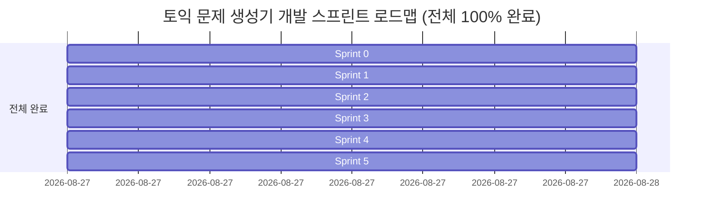

# 취약 단어 타겟형 토익 문제 생성기 (v1.0) 개발 및 완료 계획서

본 문서는 루트의 [`PRD.md`](file:///c:/test/PRD.md)에 명시된 요구사항, 제약 조건, 예외 처리 규칙(EX-1~EX-12), 완료 조건(D-1~D-12, S1~S8) 및 **Sprint 5: 하이브리드 문제은행(Lexicon Cache) & 7대 정적 가드레일/CoT 블라인드 감수관 엔진**을 완벽히 반영하여 작성된 최종 개발 계획 및 완료 보고서입니다.

---

## 1. 개요 및 핵심 원칙

### 1.1 프로젝트 개요
- **제품명**: 취약 단어 타겟형 토익 문제 생성기 (v1.0)
- **핵심 가치**: 수험생이 입력한 취약 단어(1~5개)를 반영하여 **단 1회의 AI 호출**로 Part 5 문제 3문항과 4지 선지 전체 해설을 생성하고, 풀이 시 **추가 네트워크 호출 없이 즉각(<200ms)** 해설을 제공하는 단일 화면 웹 애플리케이션.
- **범위**: 단일 화면 · 핵심 기능 1개 · 로그인/결제/DB 없음 · 무저장(In-Memory State Only).
- **진행 상태**: **Sprint 0 ~ Sprint 5 전 과정 100% 완료 (최종 배포 준비 완료)**

### 1.2 핵심 설계 및 구현 불변 원칙 (Non-Negotiable)
1. **AI 호출 세션당 정확히 1회**: 문제 생성 시 1회만 호출하며, 풀이·해설·결과 화면에서는 네트워크 요청이 절대 발생하지 않음.
2. **사전 검증 문제은행 0ms 캐시 라우팅**: 빈출 핵심 단어는 사전 검증된 In-Memory Lexicon에서 즉시(<50ms) 서빙하고, 미등록 단어만 실시간 Live LLM으로 안전 생성.
3. **영속 저장소 일체 사용 금지**: DB, `localStorage`, `sessionStorage`, `cookie`, `IndexedDB` 사용 금지 (새로고침 시 완전 초기화, 코드 감사 완료).
4. **단일 화면(Single Page State Transition)**: 라우팅/페이지 이동 없이 화면 내부 상태(Phase) 전환으로만 작동.
5. **예외 처리 및 자동 재시도 원칙**: 기술 용어 노출 금지, 부분 성공 수용(1~2문항), 사전 검증 기반 문항 폐기, CoT 블라인드 감수관 피드백 기반 자동 재시도.

---

## 2. 현 상태 분석 (As-Is vs To-Be) — 최종 달성 결과

| 영역 | 초기 상태 (As-Is) | 최종 완료 상태 (To-Be) | 달성 여부 |
|---|---|---|:---:|
| **데이터 소스** | Mock 데이터 기반 시뮬레이션 | In-Memory Lexicon 고속 캐시 + Gemini 3.6 Flash / CoT 블라인드 감수관 파이프라인 (`app/api/generate/route.ts`) | ✅ 완료 |
| **타입 & 스키마** | `Question` 인터페이스 일부 필드 불일치 | PRD §4.1 F-4 필드 명세 및 구조화 타입 100% 일치 (`lib/quiz-types.ts`) | ✅ 완료 |
| **품질 가드레일** | 단순 문자열 정합성만 검사 | 7대 정적 품질 가드레일(R-1~R-7) + CoT 블라인드 감수관(LLM-as-Judge) 이중 방어망 구축 | ✅ 완료 |
| **조사 처리** | "을(를)" 괄호/슬래시 방치 | 한국어 유니코드 종성(받침) 및 ㄹ 받침 자동 결합 유틸리티 탑재 (`lib/korean-josa.ts`) | ✅ 완료 |
| **어간/정답누출** | 단순 부분문자열 치환 버그 | 어간 정규화 굴절형 엔진(묵음 e, 자음중복, y->i) + 단어 경계(`\b`) 누출 방지 | ✅ 완료 |
| **품질 검증** | 단위/통합 테스트 없음 | 8개 테스트 스위트 총 90개 단위 테스트 100% 통과 + 45개 단어 품질 벤치마크 통과 | ✅ 완료 |

---

## 3. 스프린트 로드맵 및 진행 현황 (Sprint Roadmap)

---

## 4. 스프린트별 상세 실행 내역 및 검증 결과

### 🚀 Sprint 0: 기반 정비 및 타입/스키마 동기화 (완료)
- 타입 정의 동기화 ([`lib/quiz-types.ts`](file:///c:/test/lib/quiz-types.ts))
- 단어 파싱 유틸리티 개선 ([`lib/parse-words.ts`](file:///c:/test/lib/parse-words.ts))
- 검증: `test/sprint-0.test.ts` (15개 테스트 통과)

### 🤖 Sprint 1: AI 프롬프트 엔지니어링 및 생성 엔진 연동 (완료)
- 10대 비즈니스 도메인 무작위 배정 및 콜로케이션 프롬프트
- Route Handler 구현 ([`app/api/generate/route.ts`](file:///c:/test/app/api/generate/route.ts))
- 실시간 AI 연결 검증 도구 (`scripts/verify-gemini.mjs` / `pnpm run test:ai`)
- 검증: `test/sprint-1.test.ts` (4개 테스트 통과)

### 🛡️ Sprint 2: 사전 검증 파이프라인 및 예외 처리 (EX-1 ~ EX-12) 완비 (완료)
- EX-1 ~ EX-12 35개 예외 처리 전수 테스트 ([`test/sprint-2-exceptions.test.ts`](file:///c:/test/test/sprint-2-exceptions.test.ts)) (35개 테스트 통과)

### 🎨 Sprint 3: UI/UX 인터랙션 고도화 및 상태 머신 완성 (완료)
- 단일 화면 상태 전환 및 200ms 즉시 해설 노출
- In-Memory 무저장 감사 통과 (`localStorage` 등 0건)
- 검증: `test/sprint-3-interaction.test.ts` (3개 테스트 통과)

### 📦 Sprint 4: 종합 통합 검증 및 프로덕션 빌드 (완료)
- D-1 ~ D-12 및 S1 ~ S6 검증 통과 (`test/sprint-4-final-verification.test.ts`) (7개 테스트 통과)

### ⚡ Sprint 5: 하이브리드 문제은행(Lexicon Cache) & CoT 블라인드 감수관 (완료)
- **사전 검증 문제은행 구축 ([`lib/lexicon-database.ts`](file:///c:/test/lib/lexicon-database.ts))**: 빈출 핵심 단어 0ms 고속 캐시 서빙.
- **7대 정적 품질 가드레일 ([`lib/validator.ts`](file:///c:/test/lib/validator.ts))**:
  - R-1: 밑줄 5개(`_____`) 단일성.
  - R-2: 어간 정규화 굴절형 엔진 및 단어 경계(`\b`) 정답 누출 차단.
  - R-3: 선지 4개 고유성 및 정답 유일성.
  - R-4: 한글 해석 내 정답 영단어 미번역 방치 차단.
  - R-5: 20종 금지 조사 슬래시/괄호 패턴 차단.
  - R-6: 3-gram 해설 템플릿 복붙 탐지.
  - R-7: 단어 정리(wordNote) 실제 뜻 무결성 검증.
- **한국어 조사 자동 결합 유틸리티 ([`lib/korean-josa.ts`](file:///c:/test/lib/korean-josa.ts))**: 유니코드 종성 판별 및 `ㄹ` 받침 특수 처리 (`attachJosa`).
- **CoT 블라인드 감수관 (LLM-as-Judge)**: 정답 가림 블라인드 환경에서 독립 감수 및 최대 3회 피드백 재생성.
- **45개 단어 품질 벤치마크 ([`scripts/benchmark-quality.mjs`](file:///c:/test/scripts/benchmark-quality.mjs))**: 100% 통과.
- **검증**: `test/strict-quality-validator.test.ts` (15개) + `test/sprint-5-hybrid.test.ts` (4개) 통과.

---

## 5. 최종 테스트 및 빌드 요약

- **총 단위 테스트**: 8개 테스트 스위트, **90/90개 테스트 전수 통과 (100% Pass)**
- **품질 벤치마크**: `pnpm run bench` 통과율 **100.0%** (45/45 통과)
- **Next.js 16 프로덕션 빌드**: `pnpm run build` 성공 (Exit code 0)
