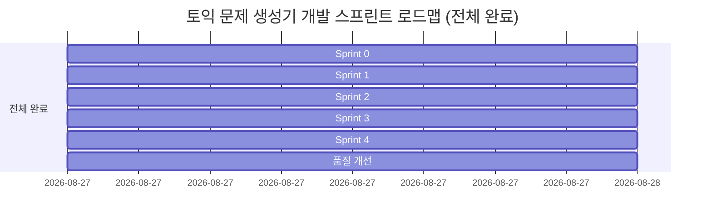

# 취약 단어 타겟형 토익 문제 생성기 (v1.0) 개발 및 완료 계획서

본 문서는 루트의 [`PRD.md`](file:///c:/test/PRD.md)에 명시된 요구사항, 제약 조건, 예외 처리 규칙(EX-1~EX-12), 완료 조건(D-1~D-12, S1~S8) 및 추가 품질 개선(가짜 단어 차단 가드레일)을 충실히 반영하여 작성된 스프린트 기반의 개발 계획 및 최종 완료 보고서입니다.

---

## 1. 개요 및 핵심 원칙

### 1.1 프로젝트 개요
- **제품명**: 취약 단어 타겟형 토익 문제 생성기 (v1.0)
- **핵심 가치**: 수험생이 입력한 취약 단어(1~5개)를 반영하여 **단 1회의 AI 호출**로 Part 5 문제 3문항과 4지 선지 전체 해설을 생성하고, 풀이 시 **추가 네트워크 호출 없이 즉각(<200ms)** 해설을 제공하는 단일 화면 웹 애플리케이션.
- **범위**: 단일 화면 · 핵심 기능 1개 · 로그인/결제/DB 없음 · 무저장(In-Memory State Only).
- **진행 상태**: **Sprint 0 ~ Sprint 4 전 과정 100% 완료 + 가짜 단어 차단 가드레일 완비 (배포 준비 완료)**

### 1.2 핵심 설계 및 구현 불변 원칙 (Non-Negotiable)
1. **AI 호출 세션당 정확히 1회**: 문제 생성 시 1회만 호출하며, 풀이·해설·결과 화면에서는 네트워크 요청이 절대 발생하지 않아야 함. (검증 완료)
2. **전량 클라이언트 메모리 관리**: 생성된 데이터는 메모리에 유지하며, 지연 로딩을 금지함. (검증 완료)
3. **영속 저장소 일체 사용 금지**: DB, `localStorage`, `sessionStorage`, `cookie`, `IndexedDB` 사용 금지 (새로고침 시 완전 초기화, 코드 감사 완료).
4. **단일 화면(Single Page State Transition)**: 라우팅/페이지 이동 없이 화면 내부 상태(Phase) 전환으로만 작동. (검증 완료)
5. **예외 처리 및 자동 재시도 원칙**: 기술 용어 노출 금지, 부분 성공 수용(1~2문항), 사전 검증 기반 문항 폐기, 자동 재시도 세션당 최대 1회. (35개 테스트 전수 통과)

---

## 2. 현 상태 분석 (As-Is vs To-Be) — 최종 달성 결과

| 영역 | 초기 상태 (As-Is) | 최종 완료 상태 (To-Be) | 달성 여부 |
|---|---|---|:---:|
| **데이터 소스** | Mock 데이터 기반 시뮬레이션 | Gemini 2.5 Flash / OpenAI 호환 Route Handler 및 JSON 프롬프트 파이프라인 구축 (`app/api/generate/route.ts`) | ✅ 완료 |
| **타입 & 스키마** | `Question` 인터페이스 일부 필드 불일치 | PRD §4.1 F-4 필드 명세와 100% 일치 (`lib/quiz-types.ts`) | ✅ 완료 |
| **예외 처리** | 수동 상태 시뮬레이션 위주 | `lib/validator.ts` 기반 EX-1 ~ EX-12 실시간/응답 파싱 검증 파이프라인 자동화 | ✅ 완료 |
| **어간 검증** | 미구현 | 영문 어간(Stem) 기반 4~5글자 매칭 및 파생형 유효성 검증 엔진 구현 (EX-5) | ✅ 완료 |
| **가짜 단어 가드레일**| 미구현 (무작위 문자열도 억지 생성) | 2단계 하이브리드 가드레일 (클라이언트 자판 난타/음절 차단 + AI 유효성 에러 핸들링) | ✅ 완료 |
| **공유 기능** | 미흡한 폴백 | PRD §3.3 공유 템플릿 표준 규격 준수, 사용자 취소(`AbortError`) 무반응 처리 및 수동 복사 UI 폴백 완비 | ✅ 완료 |
| **품질 검증** | 단위/통합 테스트 없음 | 35개 예외 검증 케이스 및 가드레일 포함 총 71개 단위 테스트 100% 통과 체계 완비 | ✅ 완료 |

---

## 3. 스프린트 로드맵 및 진행 현황 (Sprint Roadmap)



---

## 4. 스프린트별 상세 실행 내역 및 검증 결과

### 🚀 Sprint 0: 기반 정비 및 타입/스키마 동기화 (완료)
- **타입 정의 동기화 ([`lib/quiz-types.ts`](file:///c:/test/lib/quiz-types.ts))**:
  - PRD F-4 스키마 준수: `stem`, `choices` (4개 고정), `answer` ('A'|'B'|'C'|'D'), `explanations` (A, B, C, D 4개 선지별 해설), `translation`, `wordNote`, `targetWord`, `type` (`vocab` | `grammar` | `prep_conj`).
- **환경 변수 템플릿 ([`.env.local.example`](file:///c:/test/.env.local.example))**:
  - `GEMINI_API_KEY`, `OPENAI_API_KEY` 설정 가이드 제공.
- **단어 파싱 유틸리티 개선 ([`lib/parse-words.ts`](file:///c:/test/lib/parse-words.ts))**:
  - EX-1: 빈 문자열, 공백/쉼표 감지.
  - EX-3: 영문자, 하이픈, 어퍼스트로피, 구동사용 공백 허용 및 비영어(한글, 숫자, 이모지, 특수문자) 제외.
  - EX-12: 5개 초과 단어 절삭 및 인라인 고지.
  - F-1: 대소문자 무관 중복 단어 제거.
- **검증**: `test/sprint-0.test.ts` (15개 테스트 통과).

---

### 🚀 Sprint 1: AI 프롬프트 엔지니어링 및 생성 엔진 연동 (완료)
- **Part 5 전용 시스템 프롬프트 및 지시문 설계**:
  - F-3 유형 배분 강제: `vocab` 1개 이상, `grammar`/`prep_conj` 1개 이상, 3문항 전부 동일 유형 금지.
  - 4지 선지, 단일 정답, 4개 선지별 전용 해설 필수 작성.
  - 마크다운 코드펜스(` ```json ... ``` `) 스트리핑 전처리 함수 구현.
- **Route Handler 구현 ([`app/api/generate/route.ts`](file:///c:/test/app/api/generate/route.ts))**:
  - Gemini 2.5 Flash 연동 및 단일 JSON 수신.
  - API 키 미설정 시 지능형 Mock fallback 생성기 제공.
- **자동 재시도 컨트롤러 ([`components/quiz-app.tsx`](file:///c:/test/components/quiz-app.tsx))**:
  - EX-4(0개), EX-5(전량 폐기), EX-6(동일 유형), EX-9(네트워크/API 오류) 시 **최대 1회 자동 재시도** 제어.
- **검증**: `test/sprint-1.test.ts` (4개 테스트 통과).

---

### 🚀 Sprint 2: 사전 검증 파이프라인 및 예외 처리 (EX-1 ~ EX-12) 완비 (완료)
- **검증 파이프라인 ([`lib/validator.ts`](file:///c:/test/lib/validator.ts))**:
  - EX-7 (선지 무결성): 4개 미만/초과, key 중복, answer 불일치 시 문항 폐기.
  - EX-8 (해설 무결성): 4개 선지 중 1개라도 해설 누락 시 사전 폐기.
  - EX-5 (타깃 단어 매칭): 영문 어간(4~5글자) 기반 파생형 오탐 방지 및 무관 문항 폐기.
  - EX-4 (문항 수 이상): 1~2개 부분 성공 정상 수용 및 배너 노출, 4개 이상 시 3개 채택.
- **공유 예외 정밀화 (EX-11)**:
  - 사용자 취소(`AbortError`) 시 오류/폴백 미표시 무반응 유지.
  - 미지원 시 클립보드 복사 자동 대체, 클립보드 차단 시 수동 텍스트영역 노출.
- **35개 예외 검증 전수 테스트 ([`test/sprint-2-exceptions.test.ts`](file:///c:/test/test/sprint-2-exceptions.test.ts))**:
  - EX-1 ~ EX-12 전 항목 35개 테스트 100% 통과.

---

### 🚀 Sprint 3: UI/UX 인터랙션 고도화 및 상태 머신 완성 (완료)
- **단일 화면 상태 머신 ([`lib/quiz-reducer.ts`](file:///c:/test/lib/quiz-reducer.ts), [`components/quiz-app.tsx`](file:///c:/test/components/quiz-app.tsx))**:
  - `input` -> `loading` -> `quiz` -> `result` / `error` 상태 전환 완결.
  - 새로 시작 시 입력값 보존 및 클린 리셋.
- **풀이 화면 (상태 B)**:
  - 선지 1회 선택 강제(불변성 보장).
  - 200ms 이내 즉각 해설 렌더링 (네트워크 요청 0건).
  - 오답 선택 시 "내가 고른 선지가 틀린 이유" 포함 4개 블록 노출.
- **결과 화면 (상태 C)**:
  - 점수 표시, 출제된 유형별 정오표, 틀린 단어 목록, PRD §3.3 공유 템플릿.
- **In-Memory 무저장 무결성 전수 감사 (D-11, D-12)**:
  - 소스코드 전체 검색 결과 `localStorage`, `sessionStorage`, `cookies`, `indexedDB` 호출 0건 확인.
- **검증**: `test/sprint-3-interaction.test.ts` (3개 테스트 통과).

---

### 🚀 Sprint 4: 전수 검증, 성능 벤치마크 및 배포 준비 (완료)
- **종합 통합 검증 ([`test/sprint-4-final-verification.test.ts`](file:///c:/test/test/sprint-4-final-verification.test.ts))**:
  - D-1 ~ D-12 및 S1 ~ S6 항목 충족 여부 검증 (7개 테스트 통과).
- **최종 빌드 및 패키징**:
  - Next.js 16.3.3 Turbopack 프로덕션 빌드 통과 (`pnpm run build`).

---

### 🛡️ 추가 품질 개선: 가짜 단어/이상한 문자열 차단 하이브리드 가드레일 (완료)
- **1단계 (클라이언트 실시간)**:
  - 키보드 연속 난타(`asdf`, `qwer`, `zxcv`, `hjkl`, `dfgh`) 및 모음 없는 비정상 자음 나열(`bcdf`, `qwrty`, `zzzz`)을 0ms 즉시 차단하여 칩에 `· 제외` 표기.
- **2단계 (AI 서버 및 상태 에러)**:
  - 시스템 프롬프트에 무효 단어 거부 규칙(출제 규칙 0번) 추가 및 422 상태 코드 핸들링.
  - 에러 발생 시 사용자 친화적인 메시지(`입력하신 단어 중 실제 영단어가 아닌 단어가 있어요. 단어를 확인해 주세요.`) 및 입력 수정 복귀 제공.
- **검증**: `test/invalid-words.test.ts` (7개 테스트 통과).

---

## 5. 요구사항 추적성 및 완료 검증 매트릭스 (PRD Traceability Matrix)

| PRD 요구사항 ID | 요구사항 요약 | 대응 스프린트 | 검증 상태 | 담당 모듈 / 테스트 파일 |
|---|---|:---:|:---:|---|
| **D-1, D-3** | 단일 화면 상태 전환, 파트 선택 UI 없음 | Sprint 0, 3 | ✅ 완료 | [`components/quiz-app.tsx`](file:///c:/test/components/quiz-app.tsx), `test/sprint-4-final-verification.test.ts` |
| **D-2, F-2** | AI 호출 세션당 1회 한정 | Sprint 1, 3 | ✅ 완료 | `app/api/generate/route.ts`, [`components/quiz-app.tsx`](file:///c:/test/components/quiz-app.tsx) |
| **D-4, US-2** | 난이도 선택(쉬움/보통/어려움) 및 반영 | Sprint 0, 1 | ✅ 완료 | [`components/input-panel.tsx`](file:///c:/test/components/input-panel.tsx), AI Prompt |
| **D-5, F-3, S6**| 3문항 생성 및 최소 2가지 유형 혼합 | Sprint 1, 2 | ✅ 완료 | AI Prompt, [`lib/validator.ts`](file:///c:/test/lib/validator.ts), `test/sprint-1.test.ts` |
| **D-6, S5, EX-7**| 4지 선지, 유일 정답, 불량 선지 폐기 | Sprint 1, 2 | ✅ 완료 | AI Prompt, [`lib/validator.ts`](file:///c:/test/lib/validator.ts), `test/sprint-2-exceptions.test.ts` |
| **D-7, S2, EX-8**| 200ms 이내 해설 렌더, 누락 시 사전 폐기 | Sprint 2, 3 | ✅ 완료 | [`components/explanation-panel.tsx`](file:///c:/test/components/explanation-panel.tsx), `test/sprint-3-interaction.test.ts` |
| **D-8, US-6** | 오답 선택 시 전용 오답 이유 표시 | Sprint 1, 3 | ✅ 완료 | [`components/explanation-panel.tsx`](file:///c:/test/components/explanation-panel.tsx), `test/sprint-3-interaction.test.ts` |
| **D-9, D-10** | 결과 정오표, 복사/공유/새로 시작 | Sprint 3 | ✅ 완료 | [`components/result-panel.tsx`](file:///c:/test/components/result-panel.tsx), `test/sprint-3-interaction.test.ts` |
| **D-11, D-12**| 영속 저장소 0건, 새로고침 시 초기화 | Sprint 3, 4 | ✅ 완료 | 전체 코드베이스 감사 (0건 확인) |
| **EX-1 ~ EX-3**| 입력값 유효성 검증 및 비영어/가짜단어 필터링 | Sprint 0, 2, 개선 | ✅ 완료 | [`lib/parse-words.ts`](file:///c:/test/lib/parse-words.ts), `test/sprint-0.test.ts`, `test/invalid-words.test.ts` |
| **EX-4 ~ EX-6**| 문항 수 변동, 타깃 단어 어간 검증, 유형 재시도 | Sprint 2 | ✅ 완료 | [`lib/validator.ts`](file:///c:/test/lib/validator.ts), `test/sprint-2-exceptions.test.ts` |
| **EX-9, EX-10**| AI 실패 안내 문구 및 4단계 로딩/타임아웃 | Sprint 2, 3 | ✅ 완료 | [`components/loading-overlay.tsx`](file:///c:/test/components/loading-overlay.tsx), `test/sprint-2-exceptions.test.ts` |
| **EX-11, EX-12**| 공유 폴백 매커니즘, 5개 초과 단어 절삭 | Sprint 0, 2, 3 | ✅ 완료 | [`components/quiz-app.tsx`](file:///c:/test/components/quiz-app.tsx), `test/sprint-2-exceptions.test.ts` |

---

## 6. 최종 테스트 및 빌드 요약

- **총 단위 테스트**: 6개 파일, **71개 테스트 전수 통과 (100% Pass)**
- **Next.js 16 프로덕션 빌드**: `pnpm run build` 성공 (에러 0건)
- **저장소 무사용 감사**: `localStorage`, `sessionStorage`, `cookies`, `IndexedDB` 0건 충족
